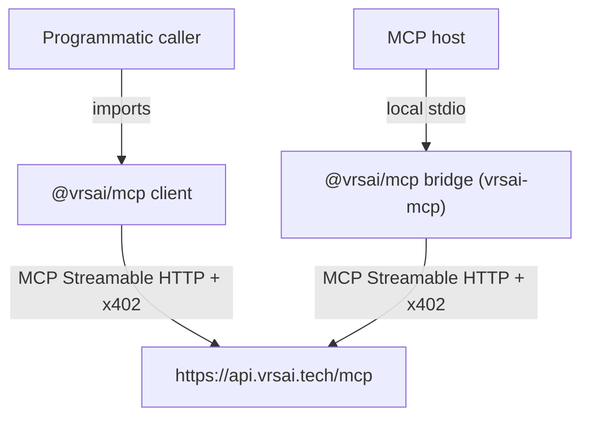

# Architecture

`@vrsai/mcp` is a buyer-side client and optional local stdio bridge. It is
not a capability server, and it does not own or duplicate any commercial
truth.

## Component boundary

Two supported entry points:

1. **Programmatic client** — a Node.js/TypeScript process imports
   `createVrsaiClient()` directly and calls tools in-process.
2. **Local stdio bridge** — an MCP host that only speaks local stdio (e.g. a
   desktop AI assistant) spawns the `vrsai-mcp` binary, which proxies
   `tools/list`/`tools/call` to the remote service over Streamable HTTP.

Both paths terminate at the same remote endpoint,
`https://api.vrsai.tech/mcp`, and speak the same wire protocol (native MCP
`2026-07-28` + x402 v2).

## What this package owns

- Buyer-side spend policy enforcement (`SpendPolicy` / `SpendLedger`).
- Signed-offer / `did:web` publisher trust verification.
- Crash-safe local payment journal and authorization resumption.
- Typed, stable error surface for programmatic callers.
- stdout/stderr separation for the stdio bridge.

## What this package does not own

- Server capability implementations.
- The authoritative capability schema/catalog (`tools/list` from the remote
  server is the source of truth at connect time).
- Pricing or commercial terms — these are declared by the server via x402
  payment requirements, not hardcoded here.
- Settlement/facilitator logic, replay state, or receipts storage on the
  server side.
- Any private vrsai infrastructure.

The remote service remains authoritative for everything it declares over the
wire. This package never caches assumptions about specific capabilities
beyond one connection's `tools/list` response, so it remains valid as the
server's capability portfolio changes.

## Repository boundary

This package has no source dependency on any private vrsai server
implementation. [`test/boundary-check.ts`](../test/boundary-check.ts) scans
every source file's relative imports and fails if any import would resolve
outside `src/`, enforcing that this repository builds, tests, and runs with
no access to any other vrsai repository.
